# 使用手册

[返回项目首页](../README.md) · [English guide](USER_GUIDE.en.md)

这份手册按实际使用顺序介绍文章阅读、词汇笔记、AI 助手和论文翻译。图片均截自本项目运行中的网页；演示资料的来源和处理方式见文末。截图使用中文界面，界面语言可以在「设置」中切换。

## 1. 启动与初次设置

按 [README 的启动步骤](../README.md#本机启动)运行项目，在浏览器打开 `http://127.0.0.1:4173`。请保持启动窗口运行，并尽量固定使用同一浏览器、同一地址：本机内容按浏览器和网站地址分别保存。

需要 AI 翻译或文章助手时，点击右上角「设置」，填写自己的 DeepSeek API Key，再点击「测试连接」。密钥只保存在当前浏览器本机，不进入项目文件或导出的备份。无需 AI 功能也能阅读文章、记词和查看 PDF。

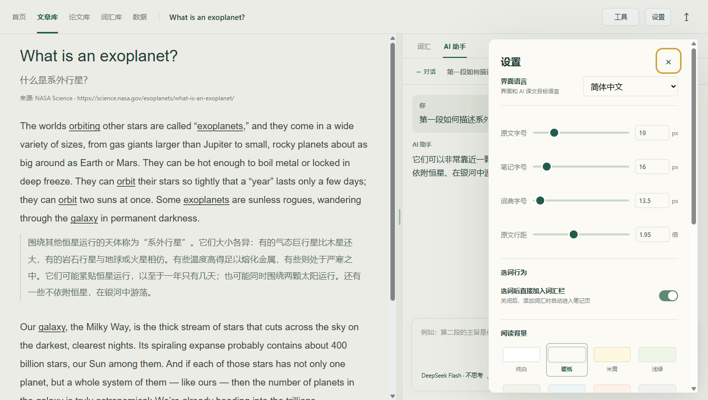

设置面板还可调整界面语言、原文字号、笔记字号、词典字号、行距、页边距和阅读背景。改动即时生效并自动保存。向下滚动设置面板可以找到 DeepSeek 配置。

## 2. 添加和整理英文文章

1. 打开「文章库」，点击右上角「＋ 添加文章」。
2. 填写标题和英文原文；来源、文件夹、中文标题和中文译文可选。原文中的空行会用于分段。
3. 点击「保存并开始阅读」。以后从文章卡片点击标题即可继续阅读。

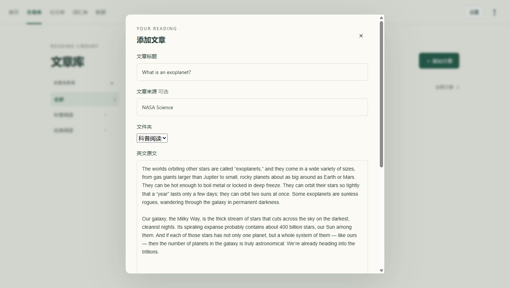

文章库左栏的「＋」可创建文件夹；卡片上的下拉框可移动文章。搜索框可按标题、来源或正文查找。编辑和删除按钮在卡片底部。删除文章后，该文章的词汇与笔记会留在词汇库中。

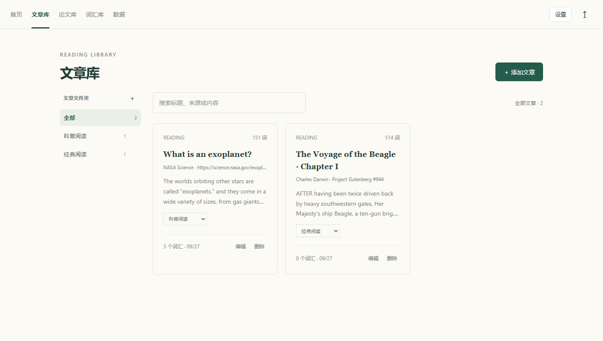

## 3. 阅读、划线与词汇笔记

阅读页左侧是原文，右侧是该文章的词汇栏。右上角「工具」中可打开「划线」和「译文」，也能编辑原文或启动 AI 翻译。开启划线后，已收录词汇及常见词形会显示为黑色下划线；点击划线词可查看笔记。

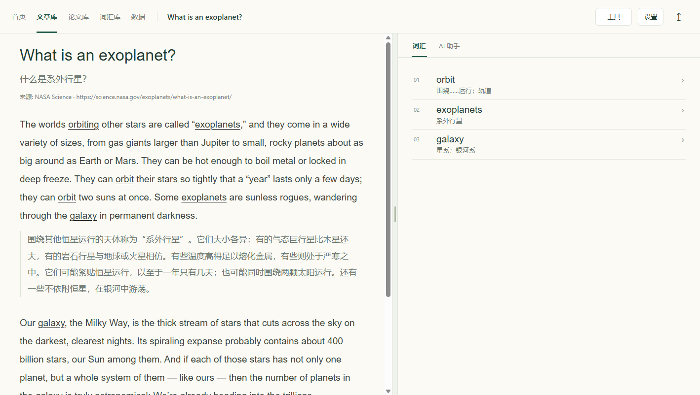

在原文中选中一个词或短语，按 **Ctrl+A** 即可加入当前文章的词汇栏。该快捷键仅在原文选区有效；输入框里仍按浏览器的正常全选行为。词汇笔记包含「中文释义」和「笔记」两项，会随输入自动保存。词汇页可搜索所有词汇，也可独立添加词汇。

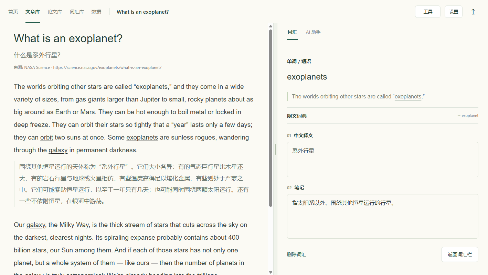

打开词汇笔记中的「朗文词典」可查本机词典。英文释义默认显示；点击词典右上角「朗文 5++」可切换中文释义，例句、搭配等补充内容可以按需展开。若词典打不开，先确认克隆仓库时已执行 `git lfs pull`。

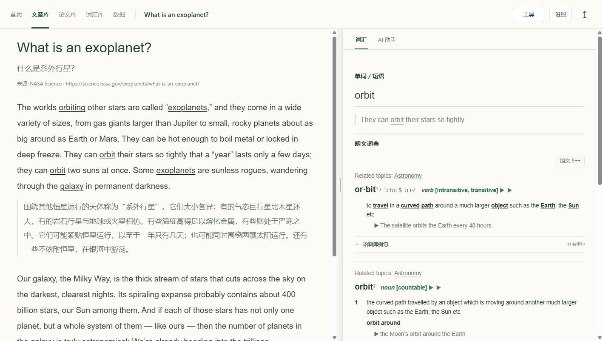

## 4. 翻译文章与向 AI 助手提问

文章翻译：在阅读页点击「工具 → AI 翻译」。生成结果会先进入预览，可修改中文标题和译文，再点击「保存译文」。保存后，打开「工具 → 译文」即可在原文段落间对照阅读。此步骤需要已设置 DeepSeek API Key。

文章提问：点击右栏的「AI 助手」。进入时先看到该文章的对话列表；选择旧对话继续，或点击「＋ 新建对话」。每篇文章的对话分别保存。

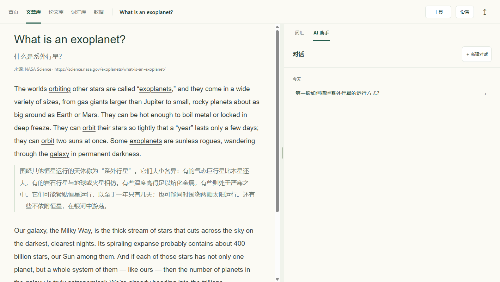

在对话底部输入问题，点击「发送」。输入框左下角可选 DeepSeek Flash 或 V4 Pro，并可控制是否思考及思考强度。开启思考时，模型返回的思考内容可在回复中展开查看。助手会参考当前文章及本段对话；请仍以原文核对关键结论。

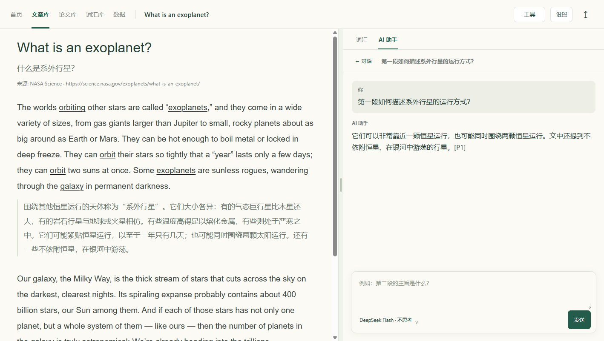

## 5. 导入和翻译论文 PDF

1. 打开「论文库」，点击「＋ 添加论文」或将 PDF 拖入页面。单篇上限为 50 MB。
2. PDF 导入后自动保存到当前浏览器，并提取文字用于翻译。可在左栏的「＋」创建论文文件夹，用卡片下拉框移动论文。
3. 点击论文卡片进入阅读页。顶部可自行填写「论文时间」，并调整所属文件夹。
4. 左侧是浏览器原生 PDF 阅读器，可缩放、搜索和复制带文字层的内容；右侧是译文区。有 API Key 时导入后会自动开始翻译；未设置时可在设置中填写，返回后点击「开始翻译」。

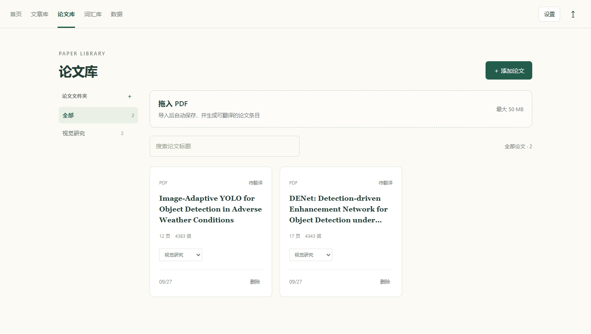

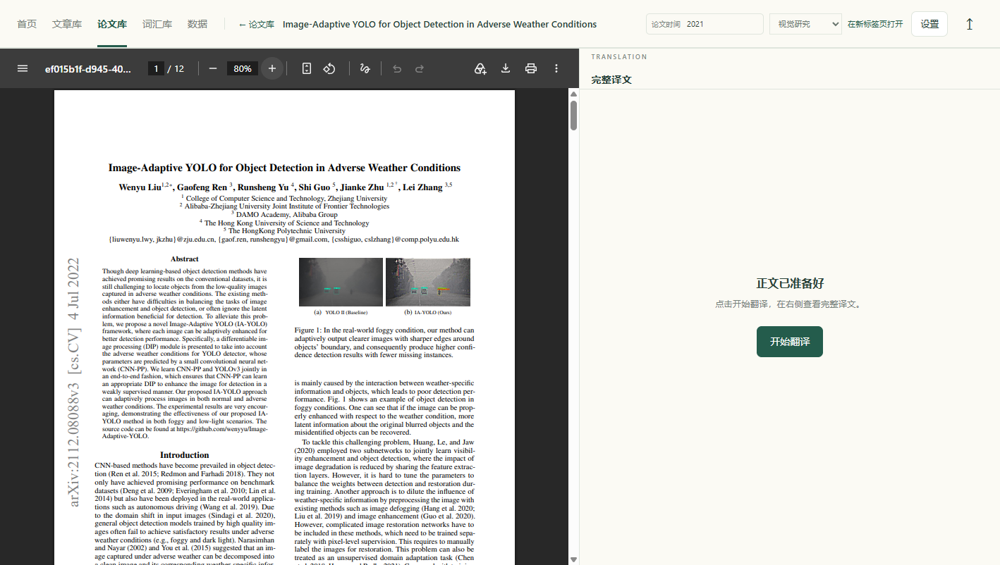

翻译过程会显示阶段、段落进度和最近活动。可以返回论文库或打开另一篇论文；同一浏览器会继续接收并保存多篇翻译结果。正在翻译时请保持网页和本机服务开启。已完成的译文下次打开仍在右侧；需要重新生成时使用「重新翻译」。

扫描版 PDF 没有可提取的文字层，当前不做 OCR。图、表、公式仍可在左侧原版 PDF 中查看；右侧翻译重点是可提取的正文。若 PDF 的双栏、脚注或公式导致提取顺序混乱，译文也可能受影响。

## 6. 备份与恢复

点击页面右上角的 **↥** 打开「数据备份」。建议定期点击「导出备份」并保存下载的 JSON 文件；「选择文件」可将旧备份合并到当前内容。也可在「设置」底部打开备份窗口。

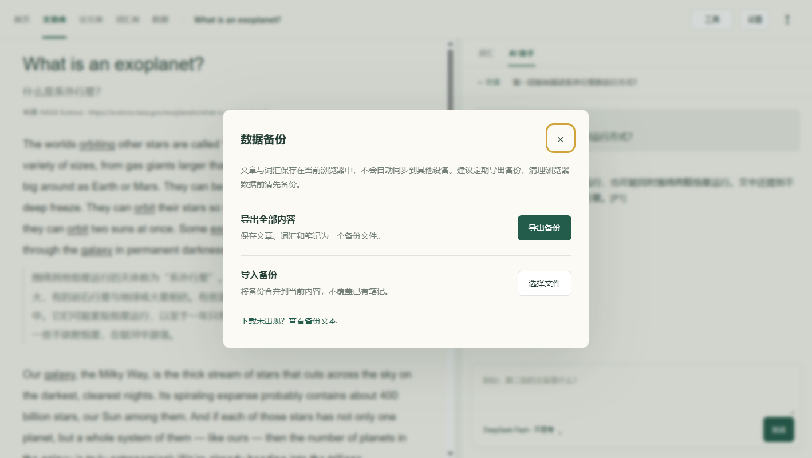

备份包含文章、词汇、文件夹、设置和 AI 助手对话，**不包含论文 PDF、论文提取文本及其译文，也不包含 API Key**。论文原文件请另行保留。清理浏览器网站数据、更换浏览器或更换访问地址，可能使原先保存在该浏览器中的内容不可见。

## 常见问题

| 情况 | 处理方法 |
| --- | --- |
| 朗文词典无法加载 | 在项目目录运行 `git lfs pull`，确认词典 `.mdx`、`.mdd` 文件已下载；重新启动本机服务。 |
| PDF 可以看，但无法翻译 | 优先确认 PDF 可以选中文字；扫描件需要先用其他工具完成 OCR，再重新导入。 |
| AI 请求失败 | 检查「设置」里的 API Key 和「测试连接」，并保持本机服务运行。 |
| 换浏览器后看不到原来的文章 | 回到原浏览器和 `127.0.0.1:4173`，或导入此前导出的 JSON 备份；论文 PDF 需重新导入。 |
| 译文与原文不一致 | 先检查 PDF 文字提取顺序和原文段落，重要内容应对照原文核实。 |

## 截图所用资料

截图确实来自运行中的项目，使用独立浏览器配置，没有读取个人数据或真实 API Key。英文文章分别来自 [NASA Science 的 *What is an exoplanet?*](https://science.nasa.gov/exoplanets/what-is-an-exoplanet/) 和 [Project Gutenberg 的达尔文《小猎犬号航海记》](https://www.gutenberg.org/ebooks/944)。论文为 [ACCV 2022 的 DENet](https://openaccess.thecvf.com/content/ACCV2022/html/Qin_DENet_Detection-driven_Enhancement_Network_for_Object_Detection_under_Adverse_Weather_ACCV_2022_paper.html) 和 [arXiv 的 Image-Adaptive YOLO](https://arxiv.org/abs/2112.08088)。仓库只收录应用截图，不收录这两篇论文的 PDF。截图中的中文文章译文、词汇笔记和助手问答为人工准备的演示内容，未调用真实 API。
